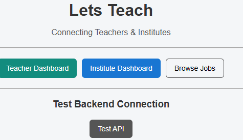
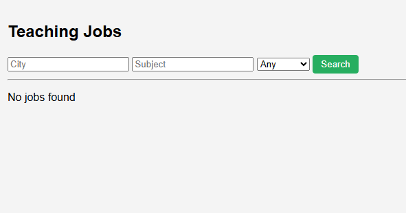
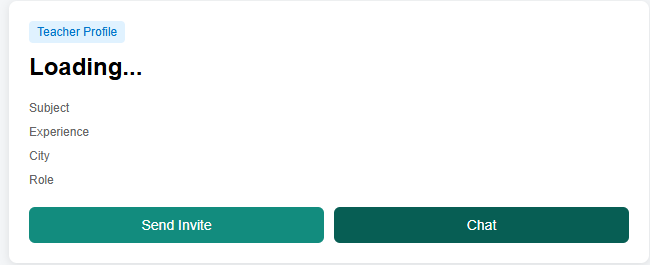
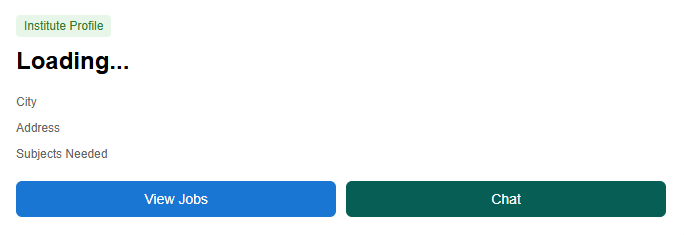
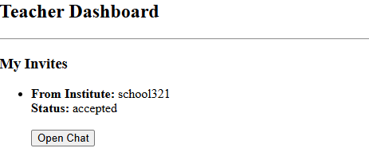
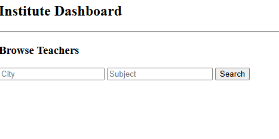
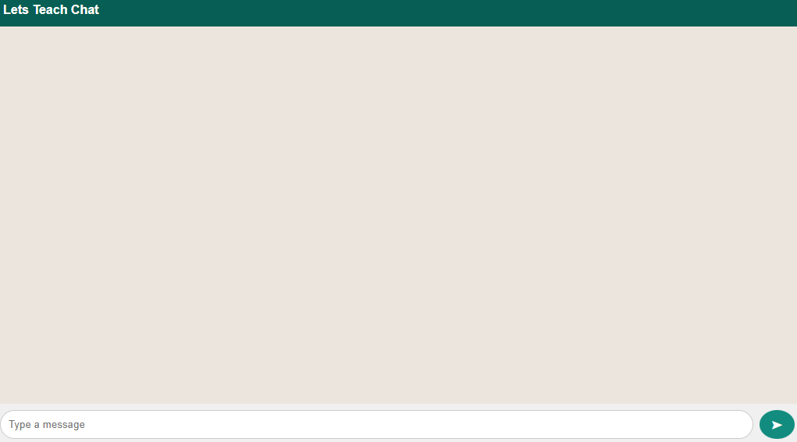

# LETS-TEACH 🎓  
A public Teacher ↔ Institute hiring & communication platform

---

## 🚀 About the Project

**LETS-TEACH** is a real-world platform that connects **teachers** and **educational institutes**.

- Institutes can discover teachers and send invites  
- Teachers can accept or reject invites  
- Secure real-time chat is enabled **only after invite acceptance**  
- Jobs can be publicly browsed before registration  

This project is built with **production-ready logic**, not as a demo CRUD app.

---

## 🌐 Live Project

- **Frontend (GitHub Pages):**  
  https://ds960066-pixel.github.io/lets-teach-frontend/

- **Backend (Render):**  
  https://express-hello-world-uh96.onrender.com

---

## 🧱 Tech Stack

### Frontend
- HTML
- CSS
- Vanilla JavaScript
- GitHub Pages (hosting)

### Backend
- Node.js
- Express.js
- MongoDB Atlas
- Socket.IO (real-time chat)
- Render (hosting)

---

## ✨ Core Features

### 👨‍🏫 Teacher Features
- Create public teacher profile
- Browse jobs without login
- Accept / reject institute invites
- Secure real-time chat after acceptance
- Dashboard with active chats

### 🏫 Institute Features
- Create institute profile
- Browse teachers publicly
- Send invites to teachers
- Chat only after invite acceptance
- Institute dashboard

### 🔐 Security Logic
- Chat allowed **only after invite acceptance**
- Role-based access (teacher / institute)
- Public vs private flow separation

---

## 🔁 Application Flow

## 📸 Screenshots

### Landing Page

### Public Jobs

### Teacher Profile

### Institute Profile

### Teacher Dashboard

### Institute Dashboard

### Realtime Chat

